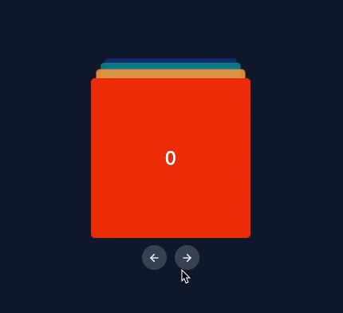
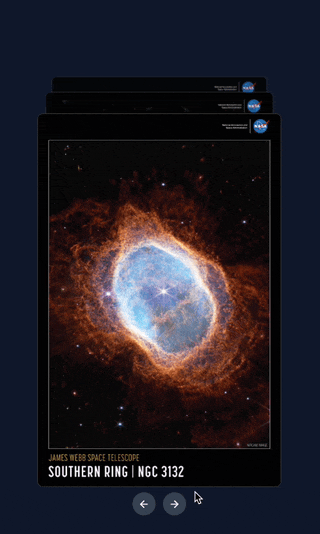

# react-card-stack-carousel

Stacked card carousal component with configurable 3D transition effect.

## Demo





## Getting started

#### Install react-card-stack-carousel from NPM

```sh
npm i react-card-stack-carousel

# OR

yarn add react-card-stack-carousel
```

#### Import react-card-stack-carousel styles

```tsx
// import base styles at the top of your component
import "react-card-stack-carousel/styles/styles.css";
```

## Usage

> NOTE: StackedCarousel requires a _height_ property to be specified

```tsx
import React from "react";
import { StackedCarousel } from "react-card-stack-carousel";
import "react-card-stack-carousel/styles/styles.css"; // import base styles

export default function App() {
    // specify container height
    const containerHeight = 250;

    return (
        <main className="container">
            <StackedCarousel height={containerHeight}>
                <div className="sample-card bg-color-1">0</div>
                <div className="sample-card bg-color-2">1</div>
                <div className="sample-card bg-color-3">2</div>
            </StackedCarousel>
        </main>
    );
}
```

## Responsive height

Height prop supports [Tailwind CSS based](https://tailwindcss.com/docs/responsive-design) breakpoint system to accommodate responsive design.
To specify a height at a certain breakpoint, prefix the breakpoint name, followed by the ":" character.

```html
<!-- 200px on mobile (default), 500px on medium screens and 750px on large screens -->
<StackedCarousel height="200 md:500 lg:750">{...}</StackedCarousel>
```

Visit [responsive-design](https://tailwindcss.com/docs/responsive-design) for the exhaustive list of supported breakpoints.

## Props

| Prop                 | Type             | Default                              | Required | Description                                       |
| -------------------- | ---------------- | ------------------------------------ | -------- | ------------------------------------------------- |
| `height`             | number or string | -                                    | Yes      | Height of the carousel.                           |
| `children`           | ReactNode        | -                                    | Yes      | Children nodes of the carousel.                   |
| `autoplay`           | boolean          | false                                | No       | Automatically transition between items.           |
| `autoplayInterval`   | number           | 4000                                 | No       | Interval between automatic transitions.           |
| `easingFunction`     | string           | cubic-bezier(0.93, 0.01, 0.39, 1.01) | No       | Easing function to use for the transitions.       |
| `onNext`             | function         | -                                    | No       | Callback function on moving to the next item.     |
| `onPrevious`         | function         | -                                    | No       | Callback function on moving to the previous item. |
| `styleOverrides`     | object           | -                                    | No       | Override default styles of the carousel           |
| `scaleFactor`        | number           | 0.9                                  | No       | Scale factor for the carousel items.              |
| `startIndex`         | number           | 0                                    | No       | Index of the item to start on.                    |
| `transitionDuration` | number           | 400                                  | No       | Duration of the transitions in milliseconds.      |
| `verticalOffset`     | number           | 10                                   | No       | % vertical offset for the carousel items.         |

## Running locally

1. Clone the repo and install the dependencies. In the repo's root, run

```sh
# using NPM
npm install

# using yarn
yarn install
```

2. Switch to the playground folder

```sh
cd ./playground
```

3. Start the development server

```sh
# start the Vite development server
yarn dev
```

## Todo

-   [ ] Auto compute the container height based on height of the active card
-   [ ] Support touch/drag gesture based navigation
-   [ ] Plugin system to enable custom transition styles
